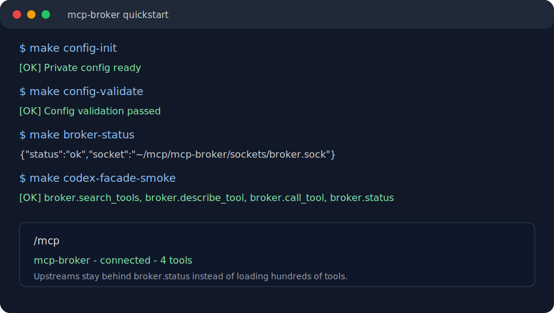

# mcp-broker
<!-- mcp-name: io.github.NavinAgrawal/mcp-broker -->

`mcp-broker` is a local Model Context Protocol process broker for MCP clients.

Think PgBouncer for MCP: one stable local endpoint in front of many upstream MCP servers. The broker owns upstream startup, reuse, cleanup, profile exposure, status, and safe tool routing.

The core idea is simple: do not make every agent session load every upstream tool definition before the user asks a task.

## Why this exists

AI coding sessions with many MCP servers tend to accumulate the same problems:

- every client config repeats the same MCP server list
- every new session can start duplicate upstream processes
- OAuth, browser state, local files, and database handles spread across tools
- raw tool lists consume context before the task begins
- hosted connector caches can duplicate local MCP tools
- orphaned MCP processes survive after client sessions exit

`mcp-broker` puts a small broker facade in front of those upstreams. It is not a hosted workflow builder; it is local infrastructure for keeping MCP clients small, predictable, and under one config contract.

```text
Client profile
        |
        | one local MCP entry
        v
  mcp-broker-client
        |
        | Unix socket
        v
  mcp-broker-daemon
        |
        | profile gates, namespace routing, status, cleanup
        v
  upstream MCP servers
```

The client sees a small set of broker tools:

```text
broker.search_tools
broker.describe_tool
broker.call_tool
broker.status
```

The upstream MCPs still exist. They are discovered and called through the broker when a task needs them.

## Measured context reduction

On 2026-05-24, the measured Codex setup went from many raw MCP and hosted app tool definitions to one broker facade plus a pruned `codex_apps` cache.

| Surface | Before | After | Reduction |
|---|---:|---:|---:|
| Direct Codex MCP server entries | 11 | 1 | 90.91% |
| MCP tool definitions | 414 | 4 | 99.03% |
| Hosted `codex_apps` tool definitions | 195 | 39 | 80.00% |
| Combined always-loaded tool definitions | 609 | 43 | 92.94% |
| Combined serialized tool payload bytes | 1,026,171 | 185,877 | 81.89% |
| Combined `o200k_base` tool tokens | 276,989 | 45,281 | 83.65% |

The 92.94% number is a tool-definition count reduction. The 83.65% number is a token reduction for canonical serialized tool payloads measured with `tiktoken` `o200k_base`.

See [docs/context-reduction-measurement.md](docs/context-reduction-measurement.md) for evidence and caveats.

## What it does

- Runs one local broker daemon over a Unix socket.
- Exposes one lightweight stdio client shim to MCP clients.
- Starts upstream MCP servers on demand.
- Reuses shared upstreams across sessions when configured.
- Isolates per-session upstreams when state must not be shared.
- Maps upstream tools into stable namespaces.
- Exposes compact search, describe, call, and status tools.
- Enforces profile-level tool budgets and exposure gates.
- Blocks mutating upstream exposure unless a profile allowlist grants it.
- Stores runtime state under `$HOME/mcp/mcp-broker`, outside the repo.
- Renders MCP client config entries with dry-run, backup, and rollback.
- Provides LaunchAgent install and uninstall flows for macOS.
- Provides Linux systemd user-service render, install, unload, and removal flows.
- Provides Windows PowerShell Scheduled Task render, install, and removal flows.
- Includes unit, journey, live, and e2e tests through Makefile targets.

Core differentiators:

- Profile-scoped exposure: each MCP client gets a configured view of upstreams instead of every tool by default.
- Mutating-tool gates: mutating upstreams stay hidden until a profile allowlist grants access.
- Lifecycle ownership: shared and per-session upstreams are started, watched, stopped, and reaped by the broker.
- Client parity checks: rendered profiles can be validated through the same compact broker facade before config is applied.

## Who this is for

Use `mcp-broker` if you:

- use Codex, Claude Code, Gemini CLI, or other MCP clients
- have more MCP tools than you want in every session
- need shared local MCP servers without duplicate process startup
- want one place for OAuth state, browser state, sockets, logs, and cleanup
- need per-client profiles instead of the same tool list everywhere
- want a small broker facade instead of raw upstream tool dumps

This repo is not an enterprise MCP control plane. It is local desktop infrastructure for developer-agent workflows.

## Current status

Implemented:

- YAML config loading from `config/broker.private.yaml`, created from `config/broker.example.yaml`.
- Strict YAML contract validation for runtime, clients, profiles, upstreams, and policy blocks.
- Public JSON Schema validation through `config/broker.schema.json`.
- Runtime path derivation from `runtime.root`.
- Tool namespace mapping from configured upstream prefixes.
- Local upstream subprocess lifecycle management and process-group cleanup.
- Broker daemon over Unix socket.
- MCP client shim and renderers for configured MCP client profiles, including Codex, Claude, and Gemini.
- Gemini profile rendering to `.gemini/settings.json`, including its MCP
  allowed-server policy.
- Dry-run client config rendering, apply-time backups, and rollback.
- LaunchAgent render and install scripts with dry-run defaults.
- Compact broker facade for search, describe, call, and status.
- Profile validation from YAML smoke probes.
- Discovery parity checks between compact client profiles.
- Public and maintainer quality gates through Makefile targets.

Wiring status:

- Codex is wired through the broker.
- Claude is wired through the broker after profile validation and manual `/mcp` acceptance.
- Gemini is wired through the broker by rendering `.gemini/settings.json`.

Public release status:

- The repo is designed to stay public-safe.
- Private upstream inventory, account paths, OAuth state, secrets, sockets, logs, and generated client configs stay outside git.
- Stable release `1.0.0` is published to PyPI and the MCP Registry; publication proof is tracked in `docs/distribution.md`.
- Docker image support is available for container-friendly configs. Docker MCP Catalog submission still requires Docker review.
- MCPB metadata is present at `mcpb/manifest.json` for local directory review.

See [ROADMAP.md](ROADMAP.md) for public-facing release work.

## Architecture

`mcp-broker` has three runtime layers:

| Layer | Responsibility |
|---|---|
| Client shim | Presents one stdio MCP server entry to each MCP client and forwards JSON-RPC over the broker socket. |
| Broker daemon | Owns profile gates, namespace routing, upstream lifecycle, status, logging, and cleanup. |
| Upstream MCP servers | Run as configured `stdio`, HTTP, streamable HTTP, or SSE connectors with shared or per-session process policy. |

The config file is the contract. Profiles decide exposure, upstreams define transport and lifecycle behavior, and smoke probes define safe read calls for validation.

## Comparison

| Approach | Best fit | Tradeoff |
|---|---|---|
| Raw MCP client config | Small setups with a few tools. | Every session loads the full tool list and each client repeats config. |
| Simple MCP proxy | Forwarding one server to one client. | Does not own upstream lifecycle, profile budgets, or cross-client cleanup. |
| Hosted app connectors | SaaS tools managed by the client provider. | Local MCP state and cross-client parity remain outside user control. |
| `mcp-broker` | Local developers with many upstream MCPs across MCP clients. | Adds a local daemon and config contract that must be installed and monitored. |

## Screenshots Or GIF

The quickstart flow should look like this:



```text
make config-init
make config-validate
make broker-status
make codex-facade-smoke
```

In an MCP client, `/mcp` should show one `mcp-broker` entry. Use `broker.status`
to inspect profile-visible upstream state.

## Quickstart

Prerequisites:

- macOS with `launchctl` for LaunchAgent use.
- Python 3.10 or newer available as `python3`.
- `make`.
- Node.js and `npx` for npm-based upstream MCP servers.
- A clone of this repo.

Package installs:

```bash
pipx install mcp-broker
uv tool install mcp-broker
brew tap NavinAgrawal/tap
brew install mcp-broker
```

Homebrew installs the same console scripts as the Python package. Package
installs do not write MCP client config; client wiring stays an explicit
Makefile action.

Docker is for container-friendly configs:

```bash
docker build -t mcp-broker:local .
docker run --rm -i mcp-broker:local
```

Local stdio clients and MCPB-style installs use the package-owned lifecycle:

```bash
mcp-broker stdio --init-if-missing
```

Create the local venv, install dependencies, and verify runtime layout:

```bash
make setup
```

Create private config from the public template:

```bash
make config-init
```

`config-init` creates the destination directory when needed and copies the public
template as the starting point. It does not import local MCP inventory, user
paths, or secrets.

Edit `config/broker.private.yaml` for local upstreams. Keep secret values out of config. Use environment variable names or files under:

```text
$HOME/mcp/mcp-broker/secrets/
```

Run the quality gate:

```bash
make quality-gate
```

Validate the configured YAML contract:

```bash
make config-validate
```

Start the broker:

```bash
make broker-start
```

Check status:

```bash
make broker-status
```

For the full install flow, see [docs/install.md](docs/install.md).

## Runtime layout

Default runtime root:

```text
$HOME/mcp/mcp-broker/
|- backups/
|- logs/
|- renders/
|- run/
|- secrets/
|- sockets/
`- state/
   `- upstreams/
```

Runtime files are not repo files. Upstream OAuth state, browser state, secret files, sockets, logs, rendered client configs, backups, and daemon state belong under the runtime root.

See [docs/runtime-layout.md](docs/runtime-layout.md).

## Client wiring

Back up a client config:

```bash
make config-backup CLIENT=codex
```

Dry-run render:

```bash
make config-render CLIENT=codex CONFIG_RENDER_APPLY=0
```

Apply after reviewing the rendered file under `$HOME/mcp/mcp-broker/renders/`:

```bash
make config-render CLIENT=codex CONFIG_RENDER_APPLY=1
```

Rollback:

```bash
make config-rollback CLIENT=codex
```

Use `CLIENT=claude` or `CLIENT=gemini` after that profile smoke passes and that
client is intended to use the broker. For new JSON-based MCP clients, generate a
starter block:

```bash
make profile-snippet NEW_PROFILE=local-client NEW_CLIENT_FORMAT=mcp-settings-json
```

See [docs/add-profile.md](docs/add-profile.md) for the full new-profile flow.

## Compact broker facade

The compact facade keeps chat-facing profiles small:

| Tool | Purpose |
|---|---|
| `broker.search_tools` | Search configured upstream tools by query. |
| `broker.describe_tool` | Return schema and metadata for one upstream tool. |
| `broker.call_tool` | Call one upstream tool through broker routing. |
| `broker.status` | Show profile-visible upstream state, passive auth probes, and last errors without starting tools. |

Codex `/mcp` shows the single `mcp-broker` entry by design. Per-upstream visibility comes from `broker.status`.

## Profiles and safety

Profiles decide which upstreams a client can see and call.

Supported concepts:

- `max_tools` protects clients from huge tool lists.
- `compact_tools_enabled` exposes broker facade tools instead of raw upstream tools.
- `broker_tool_name_style` adapts broker facade names for clients that cannot surface dotted tool names.
- `mcp_allowed_servers` renders client settings for MCP clients that require an explicit server allowlist.
- `allow_mutating_upstreams` is required before a mutating upstream can be exposed.
- `shared` mode reuses one upstream process where shared account state is acceptable.
- `per_session` mode isolates upstream state per client session.
- `disabled` mode keeps compatibility records without exposing the upstream.

Protected surfaces such as OAuth, browser state, filesystem roots, and databases require explicit config and validation. Public examples stay disabled or placeholder-based.

See [docs/security-review.md](docs/security-review.md) and [docs/upstream-compatibility-matrix.md](docs/upstream-compatibility-matrix.md).
For a deeper safety checklist, see [docs/safety.md](docs/safety.md).

## Config contract

The public template is [config/broker.example.yaml](config/broker.example.yaml).
The matching JSON Schema is [config/broker.schema.json](config/broker.schema.json).

Supported top-level sections:

```yaml
schema_version: 1
runtime: {}
broker: {}
profiles: {}
clients: {}
upstreams: {}
```

The loader rejects unknown keys. Runtime placeholders such as `{runtime.root}`, `{runtime.state_dir}`, and `{runtime.secrets_dir}` can be used in upstream command, args, working directory, and env file paths.

`make config-validate` checks the selected `CONFIG_PATH` against the public JSON Schema first, then runs the runtime loader so semantic rules are enforced from the same code path the broker uses.

Each enabled upstream exposed to a profile should define a safe smoke probe:

```yaml
smoke:
  query: read example graph
  tool: example-store.read_graph
  arguments: {}
  call: true
```

`make profile-validation PROFILE=<profile>` validates every enabled upstream visible to that profile through `broker.status`, `broker.search_tools`, `broker.describe_tool`, and the configured safe `broker.call_tool`.

## Codex operator acceptance

Repo-owned tests validate broker behavior through the local client shim. The last
Codex-specific check has to run inside an active Codex session because that is
where the deferred MCP wrapper tools exist.

Generate the current acceptance steps from YAML:

```bash
make codex-deferred-acceptance
```

The target reads the configured `smoke` probes and prints the exact
`mcp__mcp_broker__` wrapper calls for search, describe, and safe call. It does
not invoke Codex, does not call an external LLM session, and is not part of
`make quality-gate`.

See [docs/codex-deferred-tool-acceptance.md](docs/codex-deferred-tool-acceptance.md).

## LaunchAgent

Render without writing:

```bash
make launchagent-install
```

Apply and load:

```bash
make launchagent-install LAUNCHAGENT_APPLY=1
make launchagent-load
make broker-status
```

Unload or remove:

```bash
make launchagent-unload
make launchagent-uninstall LAUNCHAGENT_APPLY=1
```

## systemd

Linux user-service install uses the same runtime root and config path contract:

```bash
make systemd-install
make systemd-install SYSTEMD_APPLY=1
make systemd-load
```

For package installs, set `MCP_BROKER_DAEMON_COMMAND` to the installed daemon
path before applying the service.

## Windows

Windows startup uses PowerShell Scheduled Task commands with the same runtime
root and config path contract:

```bash
make windows-install
make windows-install WINDOWS_APPLY=1
make windows-load
```

Remove it with:

```bash
make windows-unload
make windows-uninstall WINDOWS_APPLY=1
```

## Test and release gates

Run all test tiers:

```bash
make test
```

Run the public quality gate:

```bash
make quality-gate
```

The coverage gate uses line and branch coverage for Python source.

Run the release gate when preparing a tag:

```bash
make release-gate
```

`release-gate` runs package, smoke, and mutation checks. Mutation
runs public unit and journey tests last and writes
`var/quality/mutation_stats.json` with total counts, score, and ranked
`blocked_by_file` entries. On macOS, the release gate runs mutation inside a
Linux container to avoid local mutmut fork failures. E2E tests remain in `make
quality-gate`.

Run smoke and runtime cleanup checks:

```bash
make config-validate
make broker-smoke
make broker-stop
make broker-reap
make doctor
make release-smoke
```

Release or client config apply should wait for:

- `make quality-gate`
- `make config-validate`
- `make broker-smoke`
- dry-run config render for each intended client
- rollback test
- `make release-smoke`
- `make release-gate` before tagging
- `make doctor` with no stale broker-owned resources

See [docs/release-checklist.md](docs/release-checklist.md).

## Public commands

These targets use this repo plus declared Python and Node prerequisites:

```bash
make setup
make config-init
make test
make test-unit
make test-journey
make test-live
make test-e2e
make test-cov
make precommit
make quality-gate
make release-gate
make config-validate
make broker-smoke
make broker-start
make broker-status
make broker-stop
make broker-reap
make doctor
make config-backup
make codex-app-policy
make config-render
make config-rollback
make tools-count
make facade-smoke
make codex-facade-smoke
make claude-facade-smoke
make gemini-facade-smoke
make profile-validation
make codex-profile-validation
make claude-profile-validation
make gemini-profile-validation
make discovery-parity
make codex-claude-discovery-parity
make codex-deferred-acceptance
make launchagent-install
make launchagent-load
make launchagent-unload
make launchagent-uninstall
make systemd-install
make systemd-load
make systemd-unload
make systemd-uninstall
make windows-install
make windows-load
make windows-unload
make windows-uninstall
make linux-container-smoke
make windows-powershell-smoke
make release-smoke
make mutation
make mutation-linux
```

`make quality-gate` is repo-local. It does not call personal scripts outside this repo.

`make codex-deferred-acceptance` is maintainer-only. It does not invoke Codex
or an external LLM session. It reads the same YAML `smoke` probes and prints the
exact `mcp__mcp_broker__` deferred wrapper calls to run inside an active Codex
session. See [docs/codex-deferred-tool-acceptance.md](docs/codex-deferred-tool-acceptance.md).

## Project tree

```text
mcp-broker/
|- .gitignore
|- Makefile
|- README.md
|- pyproject.toml
|- requirements.txt
|- config/
|  |- broker.example.yaml
|  |- broker.private.yaml        # local, ignored by git
|  `- broker.schema.json
|- docs/
|- registry/
|- scripts/
|  `- check_mutation_stats.py
|- src/
|  `- mcp_broker/
|- tests/
|  |- unit/
|  |- journey/
|  |- live/
|  |- e2e/
|  `- support/
`- var/                         # tracked skeleton; generated contents ignored
```

Generated reports stay under `var/`, especially `var/coverage/`, `var/test-logs/`, and `var/quality/`.

## Docs

- [SECURITY.md](SECURITY.md)
- [CONTRIBUTING.md](CONTRIBUTING.md)
- [ROADMAP.md](ROADMAP.md)
- [docs/install.md](docs/install.md)
- [docs/add-profile.md](docs/add-profile.md)
- [docs/migration.md](docs/migration.md)
- [docs/adoption-guide.md](docs/adoption-guide.md)
- [docs/comparison.md](docs/comparison.md)
- [docs/distribution.md](docs/distribution.md)
- [docs/github-publication.md](docs/github-publication.md)
- [docs/community-launch.md](docs/community-launch.md)
- [docs/auth-recipes.md](docs/auth-recipes.md)
- [docs/architecture.md](docs/architecture.md)
- [docs/protocol.md](docs/protocol.md)
- [docs/runtime-layout.md](docs/runtime-layout.md)
- [docs/safety.md](docs/safety.md)
- [docs/security-review.md](docs/security-review.md)
- [docs/upstream-compatibility-matrix.md](docs/upstream-compatibility-matrix.md)
- [docs/codex-deferred-tool-acceptance.md](docs/codex-deferred-tool-acceptance.md)
- [docs/context-reduction-measurement.md](docs/context-reduction-measurement.md)
- [docs/mutation-testing.md](docs/mutation-testing.md)
- [docs/release-checklist.md](docs/release-checklist.md)
- [docs/troubleshooting.md](docs/troubleshooting.md)

## Design rules

- Keep upstream definitions in central config.
- Keep runtime state under `$HOME/mcp/mcp-broker`.
- Keep private upstream inventory in `config/broker.private.yaml`, which is ignored by git.
- Keep secret values out of config and source.
- Do not hardcode personal paths in source, tests, docs, or public config.
- Run build, test, runtime, and config operations through the Makefile.
